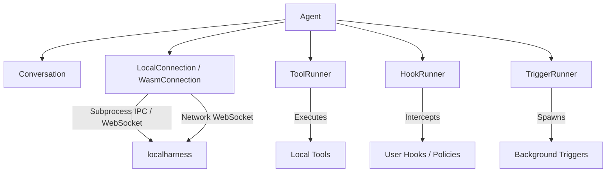
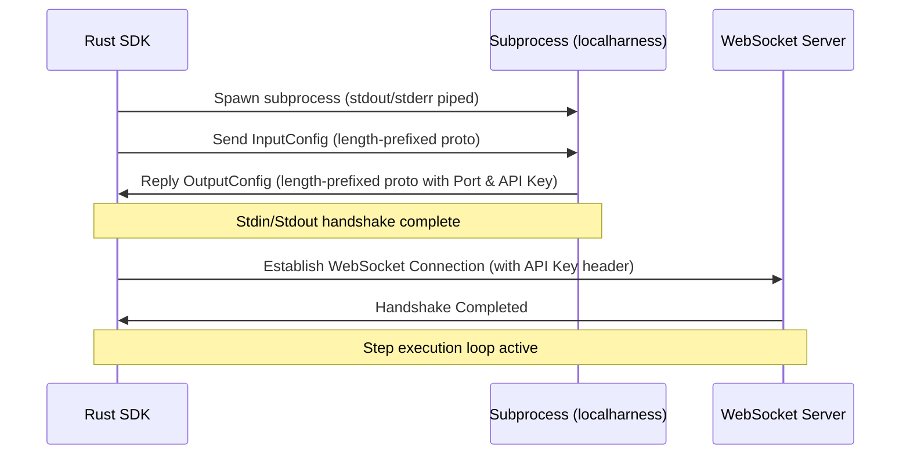
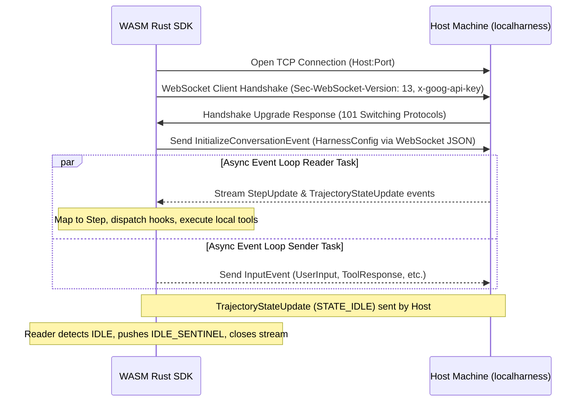

# Antigravity Rust SDK Architecture

This document describes the high-level architecture, design patterns, and components of the Antigravity Rust SDK.

---

## High-Level Overview

The Antigravity SDK orchestrates interactions between an LLM-based agent (running inside a local or remote harness) and the local client system. It manages process execution, IPC handshake, WebSocket event streaming, tool calls, policy middleware, and user hooks.



---

## Design Patterns

The SDK leverages several object-oriented and functional design patterns:

### 1. Connection & Strategy Pattern (`connection.rs`, `local.rs`, `wasm.rs`)
- **Connection Trait**: Defines an abstraction for communication. This allows swapping the local subprocess harness with other backends (e.g., remote, mock, or WASM-based network harnesses) in the future.
- **LocalConnectionStrategy**: Configures and initializes a `LocalConnection` by spawning a local helper subprocess (for native / non-WASM environments).
- **WasmConnectionStrategy**: Configures and initializes a `WasmConnection` that connects to a remote or host-side `localharness` WebSocket server over TCP (enabled for `target_arch = "wasm32"` environments where subprocess spawning is not supported).

### 2. Observer Pattern (`hooks.rs`)
- **Hook Trait**: Defines lifecycle hooks that users can register to observe and modify agent actions:
  - `on_session_start()`
  - `pre_turn()`
  - `pre_tool_call()`
  - `post_tool_call()`
  - `on_tool_error()`
  - `on_interaction()`
- **HookRunner**: Coordinates a thread-safe list of observers (`Arc<dyn DynHook>`) and dispatches events asynchronously.

### 3. Middleware / Interceptor Pattern (`policy.rs`)
- **Policy**: Acts as a middleware layer to authorize, deny, or intercept tool calls before they are executed.
- Included Policies:
  - `workspace_only(paths)`: Blocks tool calls targeting directories outside the specified workspaces.
  - `confirm_run_command()`: Prompts user authorization or automatically enforces constraints before running shell commands.

### 4. Command Pattern (`tools.rs`)
- **Tool Trait**: Encapsulates specific capabilities (e.g., file edits, command execution, directory searching) into unified command units.
- **ToolRunner**: Coordinates registration and execution of these command objects, mapping harness tool calls to their respective handlers.

### 5. Background Trigger Pattern (`triggers.rs`)
- **Trigger Trait**: Defines asynchronous background tasks (such as status polling, listener intervals, etc.) that can interact with the connection session concurrently.
- **TriggerRunner**: Coordinates and spawns registered triggers in separate tasks when the agent session starts.

### 6. Typestate Pattern (`agent.rs`)
- Enforces at compile-time that session-level actions (e.g., calling `chat()`, calling `stop()`, or accessing the active `conversation()`) can only be performed after the agent has been successfully started.
- The `Agent<S>` struct is generic over a marker lifecycle type `S: AgentLifecycle` which can be `Unstarted` or `Started`.
- Calling `agent.start().await` consumes the `Agent<Unstarted>` instance and returns a Result holding an `Agent<Started>` instance upon a successful handshake.

### 7. Builder Pattern with Phantom Data (`agent.rs`)
- The `AgentBuilder` provides a fluent configuration API.
- Leverages compile-time phantom data state (`NoPolicies` vs `HasPolicies`) to guarantee that safety policies must be explicitly configured or bypassed before an agent can be constructed via `build()`.
- An escape hatch `build_unchecked()` is provided for advanced scenarios (e.g., during programmatic test setup).

---

## Component Details

### Connection Lifecycle (Native Subprocess)

The connection to `localharness` via subprocess follows a strict handshake and upgrade protocol:



1. **Subprocess Spawn**: The SDK spawns the `localharness` binary as a child process.
2. **Handshake**: The SDK sends an `InputConfig` (serialized protocol buffer, prefixed by its length in bytes) over stdin. The harness replies with an `OutputConfig` containing the dynamically selected port and a secure API key.
3. **Upgrade**: The SDK initiates a WebSocket client connection to the harness server using the retrieved port and API key, upgrading communication to a structured bi-directional stream.
4. **Disconnection**: When dropped, the subprocess is killed cleanly.

### Connection Lifecycle (WebAssembly Network Target)

For WebAssembly targets (`wasm32-wasip1`), the SDK cannot spawn a subprocess since WASM runtimes lack process control. Instead, it connects to a running host-side `localharness` process over a network WebSocket connection via `WasmConnectionStrategy` and `WasmConnection`.



The lifecycle details:
1. **TCP Connection**: The SDK establishes a standard TCP stream to the host running the harness (configured via environment variables `ANTIGRAVITY_HARNESS_HOST` and `ANTIGRAVITY_HARNESS_PORT`).
2. **WebSocket Upgrade & Authentication**: It performs a client upgrade handshake with the harness using the `x-goog-api-key` header to authenticate.
3. **Stream Non-blocking Upgrade**: The TCP stream is transitioned to non-blocking mode to support cooperative asynchronous scheduling.
4. **Harness Initialization**: An `InitializeConversationEvent` is sent over the WebSocket containing the full `HarnessConfig` protobuf serialized as JSON. This registers active capabilities, workspaces, custom tools, and system instructions.
5. **Event Loops & Sentinel Termination**: The connection spawns a Reader task and a Sender task. The event loops stream step updates. Once a `TrajectoryStateUpdate` with `STATE_IDLE` is received, the connection knows the execution trajectory is complete. It pushes an `IDLE_SENTINEL` step to the receiver channel, which signals the consumer stream to yield `None` and terminate cleanly.

### Client-Side Tool Step Interception & Streaming

While standard tool executions are managed internally by the remote/local harness and streamed as native harness steps, client-side tools (custom tool registrations) run within the Rust process context. To ensure they are fully visible to client interfaces and timeline loggers:

1. **Step Interception**: Upon receiving a `ToolCall` event, the SDK connection intercepts it prior to calling the registry.
2. **ACTIVE Step Emission**: The connection immediately constructs a synthetic `Step` with `status: StepStatus::Active` and streams it down to the `step_tx` channel. This notifies client interfaces that the tool is active, allowing them to render executing cards/spinners.
3. **Execution & Hook Processing**: The connection runs pre-tool-call hooks/policies. If any policy denies execution, the connection generates a synthetic `ERROR` state step, sends a denial response back to the harness, and terminates the tool task.
4. **Completion Step Emission**: If allowed and executed, the outcome of the client tool is captured. The connection emits a synthetic `DONE` state step containing the execution outputs (or an `ERROR` state step containing the execution panic/error message) down to `step_tx`.
5. **Synthetic Indexing**: To prevent collisions with actual step numbers tracked by the `localharness` (which are typically sequential starting from 0/1), all synthetic client-side tool steps are indexed sequentially starting at `50,000`.

---


## Thread Safety & Concurrency

- **Lock Scoping**: Mutexes (`tokio::sync::Mutex`) are carefully scoped to minimize contention. Mutex guards are explicitly dropped before any `.await` points to avoid deadlocks.
- **Hook Dispatch**: Hook guards are cloned and dropped prior to executing hooks asynchronously, ensuring the agent's internal state remains responsive.

### Thread Safety and Event Loop under WASM

Standard native runtimes run on multi-threaded thread pools. In contrast, WASM runtimes (like `wasm32-wasip1`) operate on a single-threaded execution model. To ensure robustness and prevent deadlocks/starvation:
- **Non-Blocking IO**: The underlying socket in `WasmConnection` is set to non-blocking.
- **Cooperative Yielding**: The WS Sender task utilizes `try_lock()` on the shared socket mutex. If the socket is locked by the reader or another operation, the sender cooperatively sleeps with an exponential backoff (`5ms` doubling up to `50ms`), yielding the thread back to the runtime executor to prevent starving other tasks on the single thread.
- **Task Spawning**: The SDK uses a unified `spawn_task` abstraction that adapts to target runtimes, ensuring background futures run concurrently.

---

## Object Safety (dyn Compatibility) and Native Async Traits in Rust 2024

The SDK has been fully refactored to leverage native async traits (stable since Rust 1.75 / Rust 2024), completely removing the dependency on the `#[async_trait]` macro.

- **Native Async Traits**: Traits like `Connection`, `Hook`, `Tool`, and `Trigger` are implemented as native async traits using standard `async fn` syntax or returning `impl Future + Send` to ensure compiler-enforced thread safety boundaries.
- **Companion Trait Pattern for Dynamic Dispatch**: Native async traits are not directly object-safe (`dyn Trait` compatible) because they return anonymous concrete futures. To support dynamic dispatch, the SDK defines companion traits `DynHook`, `DynTool`, and `DynTrigger` which are object-safe and return boxed futures (`BoxFuture`).
- **Zero-overhead Blanket Implementations**: The companion traits are automatically implemented via blanket implementations for any type implementing the base trait:
  ```rust
  pub trait DynHook: Send + Sync {
      fn on_session_start(&self) -> BoxFuture<'_, Result<(), anyhow::Error>>;
      // ...
  }

  impl<T: Hook + ?Sized> DynHook for T {
      fn on_session_start(&self) -> BoxFuture<'_, Result<(), anyhow::Error>> {
          Box::pin(async move { self.on_session_start().await })
      }
      // ...
  }
  ```
  This provides the best of both worlds: clean, idiomatic implementation of async traits for developers using standard Rust 2024 features, while preserving the internal ability to handle collections of dynamic trait objects (e.g. `Arc<dyn DynHook>` in `HookRunner`, `Arc<dyn DynTool>` in `ToolRunner`, `AnyConnection` enum dispatch, etc.).
