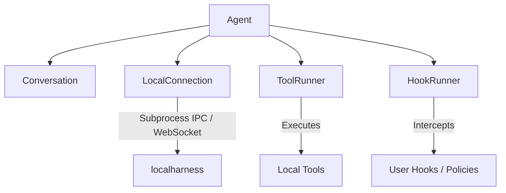
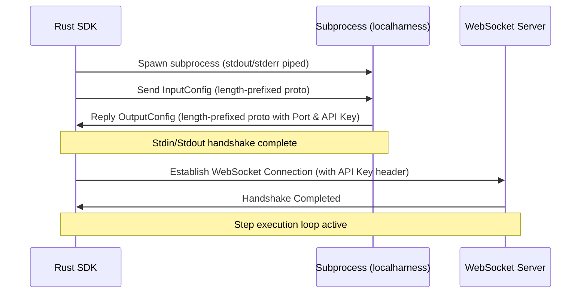

# Antigravity Rust SDK Architecture

This document describes the high-level architecture, design patterns, and components of the Antigravity Rust SDK.

---

## High-Level Overview

The Antigravity SDK orchestrates interactions between an LLM-based agent (running inside a local or remote harness) and the local client system. It manages process execution, IPC handshake, WebSocket event streaming, tool calls, policy middleware, and user hooks.

---

## Design Patterns

The SDK leverages several object-oriented and functional design patterns:

### 1. Connection & Strategy Pattern (`connection.rs`, `local.rs`)
- **Connection Trait**: Defines an abstraction for communication. This allows swapping the local subprocess harness with other backends (e.g., remote or mock harnesses) in the future.
- **LocalConnectionStrategy**: Acts as a builder/strategy to configure and initialize a `LocalConnection`.

### 2. Observer Pattern (`hooks.rs`)
- **Hook Trait**: Defines lifecycle hooks that users can register to observe and modify agent actions:
  - `on_session_start()`
  - `pre_turn()`
  - `pre_tool_call()`
  - `post_tool_call()`
  - `on_tool_error()`
  - `on_interaction()`
- **HookRunner**: Coordinates a thread-safe list of observers (`Arc<dyn Hook>`) and dispatches events asynchronously.

### 3. Middleware / Interceptor Pattern (`policy.rs`)
- **Policy**: Acts as a middleware layer to authorize, deny, or intercept tool calls before they are executed.
- Included Policies:
  - `workspace_only(paths)`: Blocks tool calls targeting directories outside the specified workspaces.
  - `confirm_run_command()`: Prompts user authorization or automatically enforces constraints before running shell commands.

### 4. Command Pattern (`tools.rs`)
- **Tool Trait**: Encapsulates specific capabilities (e.g., file edits, command execution, directory searching) into unified command units.
- **ToolRunner**: Coordinates registration and execution of these command objects, mapping harness tool calls to their respective handlers.

---

## Component Details

### Connection Lifecycle

The connection to `localharness` follows a strict handshake and upgrade protocol:

1. **Subprocess Spawn**: The SDK spawns the `localharness` binary as a child process.
2. **Handshake**: The SDK sends an `InputConfig` (serialized protocol buffer, prefixed by its length in bytes) over stdin. The harness replies with an `OutputConfig` containing the dynamically selected port and a secure API key.
3. **Upgrade**: The SDK initiates a WebSocket client connection to the harness server using the retrieved port and API key, upgrading communication to a structured bi-directional stream.
4. **Disconnection**: When dropped, the subprocess is killed cleanly.

---

## Thread Safety & Concurrency

- **Lock Scoping**: Mutexes (`tokio::sync::Mutex`) are carefully scoped to minimize contention. Mutex guards are explicitly dropped before any `.await` points to avoid deadlocks.
- **Hook Dispatch**: Hook guards are cloned and dropped prior to executing hooks asynchronously, ensuring the agent's internal state remains responsive.
