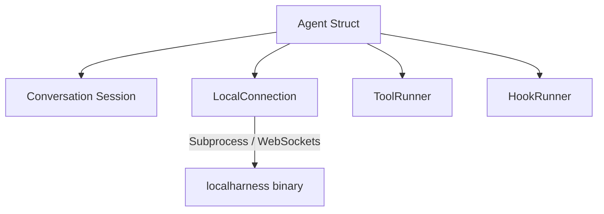
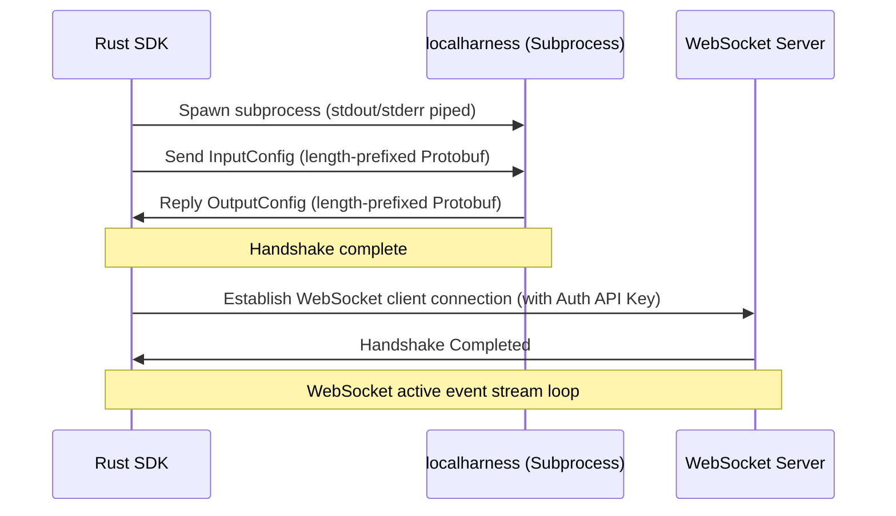
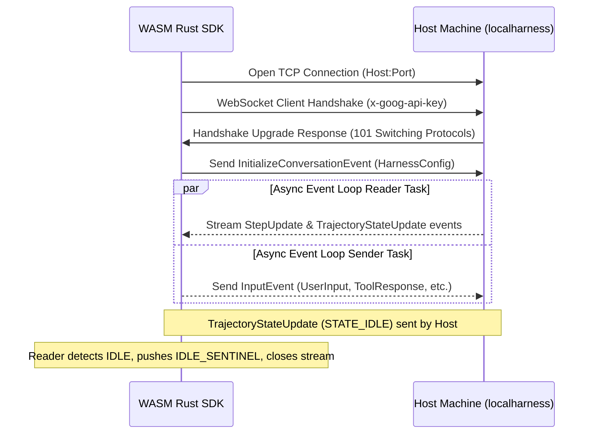

# Google Antigravity Rust SDK Architecture

This reference guide describes the high-level architecture, design patterns, and components of the Antigravity Rust SDK.

## Core Component Overview

The SDK orchestrates the interactions between an LLM-based agent (running inside a local helper process) and the host environment:

* **`Agent`**: Encapsulates binary discovery, workspace checks, safety policy enforcement, and registers tools/hooks.
* **`Conversation`**: Manages a stateful agent turn. It coordinates the chat completion stream, accumulates step history, and decodes thoughts and text responses.
* **`Connection`**: The abstract communication trait. This allows swap-in backends (e.g. standard subprocess IPC or WebSockets).
* **`Hook`**: Callback observers (`on_session_start`, `pre_turn`, `pre_tool_call`, `post_tool_call`, `on_tool_error`, `on_interaction`) allowing custom logic injection.
* **`Policy`**: Middleware layer enforcing rules (e.g., workspace lock, prompt-to-run).
* **`Tool`**: Custom Rust capabilities exposed to the Gemini model.



---

## Connection & Handshake Lifecycle

Communication with the underlying `localharness` binary follows one of two strategies:

### 1. Native Subprocess Handshake Lifecycle



1. **Subprocess Spawn**: The SDK spawns the `localharness` child process with pipes for stdin, stdout, and stderr.
2. **Handshake**: The SDK encodes an `InputConfig` Protobuf, prefixing it with its length in bytes (little-endian u32), and writes it to stdin. The harness decodes it and writes a similarly length-prefixed `OutputConfig` back to stdout, containing a dynamic port and secure API key.
3. **WebSocket Upgrade**: The SDK initializes a `tokio-tungstenite` WebSocket client to `ws://localhost:<port>/` using the header `x-goog-api-key`.
4. **WebSocket Loop**: Communication is handled asynchronously via structured JSON event envelopes (mapped to Protobuf structures).

### 2. WebAssembly (`wasm32-wasip1`) Network Handshake Lifecycle

Since process spawning is not supported inside WebAssembly sandboxes, the SDK connects directly to a running host-side harness server over a TCP connection:



---

## Concurrency & Thread Safety

The SDK is designed for asynchronous runtimes:

* **Mutex Scoping**: Mutexes (`tokio::sync::Mutex`) are carefully scoped to minimize contention. Mutex guards are explicitly dropped before any `.await` points to avoid deadlocks.
* **Hook Dispatch**: Hook structures are stored inside thread-safe `Arc<dyn DynHook>` structures. Lifecycle triggers clone references and dispatch callbacks asynchronously so the main agent event loop is never blocked.

### Thread Safety and Event Loop under WASM

Standard native runtimes run on multi-threaded thread pools. In contrast, WASM runtimes (like `wasm32-wasip1`) operate on a single-threaded execution model. To ensure robustness and prevent deadlocks/starvation:
- **Non-Blocking IO**: The underlying socket in `WasmConnection` is set to non-blocking.
- **Cooperative Yielding**: The WS Sender task utilizes `try_lock()` on the shared socket mutex. If the socket is locked by the reader or another operation, the sender cooperatively sleeps with an exponential backoff (`5ms` doubling up to `50ms`), yielding the thread back to the runtime executor to prevent starving other tasks on the single thread.
- **Task Spawning**: The SDK uses a unified `spawn_task` abstraction that adapts to target runtimes, ensuring background futures run concurrently.

---

## Object Safety (dyn Compatibility) and Native Async Traits in Rust 2024

The SDK has been fully refactored to leverage native async traits (stable since Rust 1.75 / Rust 2024), completely removing the dependency on the `#[async_trait]` macro.

- **Native Async Traits**: Traits like `Connection`, `Hook`, `Tool`, and `Trigger` are implemented as native async traits using standard `async fn` syntax or returning `impl Future + Send` to ensure compiler-enforced thread safety boundaries.
- **Companion Trait Pattern for Dynamic Dispatch**: Native async traits are not directly object-safe (`dyn Trait` compatible) because they return anonymous concrete futures. To support dynamic dispatch, the SDK defines companion traits `DynHook`, `DynTool`, and `DynTrigger` which are object-safe and return boxed futures (`BoxFuture`).
- **Zero-overhead Blanket Implementations**: The companion traits are automatically implemented via blanket implementations for any type implementing the base trait:
  ```rust
  pub trait DynHook: Send + Sync {
      fn on_session_start(&self) -> BoxFuture<'_, Result<(), anyhow::Error>>;
      // ...
  }

  impl<T: Hook + ?Sized> DynHook for T {
      fn on_session_start(&self) -> BoxFuture<'_, Result<(), anyhow::Error>> {
          Box::pin(async move { self.on_session_start().await })
      }
      // ...
  }
  ```
  This provides the best of both worlds: clean, idiomatic implementation of async traits for developers using standard Rust 2024 features, while preserving the internal ability to handle collections of dynamic trait objects (e.g. `Arc<dyn DynHook>` in `HookRunner`, `Arc<dyn DynTool>` in `ToolRunner`, `AnyConnection` enum dispatch, etc.).
