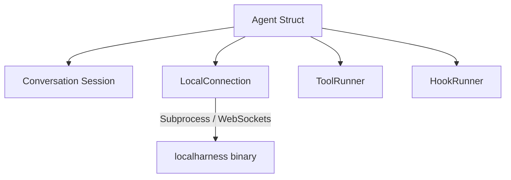
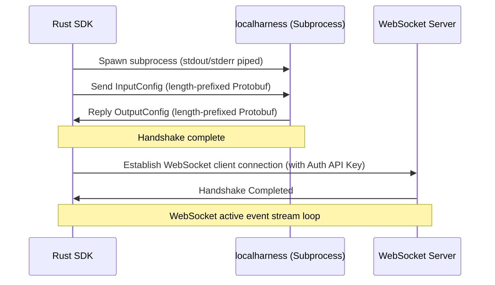

# Google Antigravity Rust SDK Architecture

This reference guide describes the high-level architecture, design patterns, and components of the Antigravity Rust SDK.

## Core Component Overview

The SDK orchestrates the interactions between an LLM-based agent (running inside a local helper process) and the host environment:

* **`Agent`**: Encapsulates binary discovery, workspace checks, safety policy enforcement, and registers tools/hooks.
* **`Conversation`**: Manages a stateful agent turn. It coordinates the chat completion stream, accumulates step history, and decodes thoughts and text responses.
* **`Connection`**: The abstract communication trait. This allows swap-in backends (e.g. standard subprocess IPC or WebSockets).
* **`Hook`**: Callback observers (`pre_turn`, `pre_tool_call`, `post_tool_call`, `on_tool_error`) allowing custom logic injection.
* **`Policy`**: Middleware layer enforcing rules (e.g., workspace lock, prompt-to-run).
* **`Tool`**: Custom Rust capabilities exposed to the Gemini model.

---

## Connection & Handshake Lifecycle

Communication with the underlying `localharness` binary follows a strict handshake and upgrade protocol:

1. **Subprocess Spawn**: The SDK spawns the `localharness` child process with pipes for stdin, stdout, and stderr.
2. **Handshake**: The SDK encodes an `InputConfig` Protobuf, prefixing it with its length in bytes (little-endian u32), and writes it to stdin. The harness decodes it and writes a similarly length-prefixed `OutputConfig` back to stdout, containing a dynamic port and secure API key.
3. **WebSocket Upgrade**: The SDK initializes a `tokio-tungstenite` WebSocket client to `ws://localhost:<port>/` using the header `x-goog-api-key`.
4. **WebSocket Loop**: Communication is handled asynchronously via structured JSON event envelopes (mapped to Protobuf structures).

---

## Concurrency & Thread Safety

The SDK is designed for asynchronous, multi-threaded runtimes (built on `tokio`):

* **Mutex Scoping**: Mutexes (`tokio::sync::Mutex`) are carefully scoped to minimize contention. Mutex guards are explicitly dropped before any `.await` points to avoid deadlocks.
* **Hook Dispatch**: Hook structures are stored inside thread-safe `Arc<dyn Hook>` structures. Life-cycle triggers clone references and dispatch callbacks asynchronously so the main agent event loop is never blocked.
